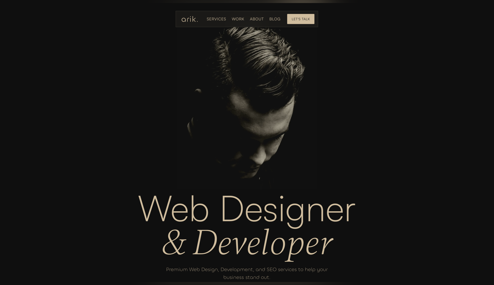
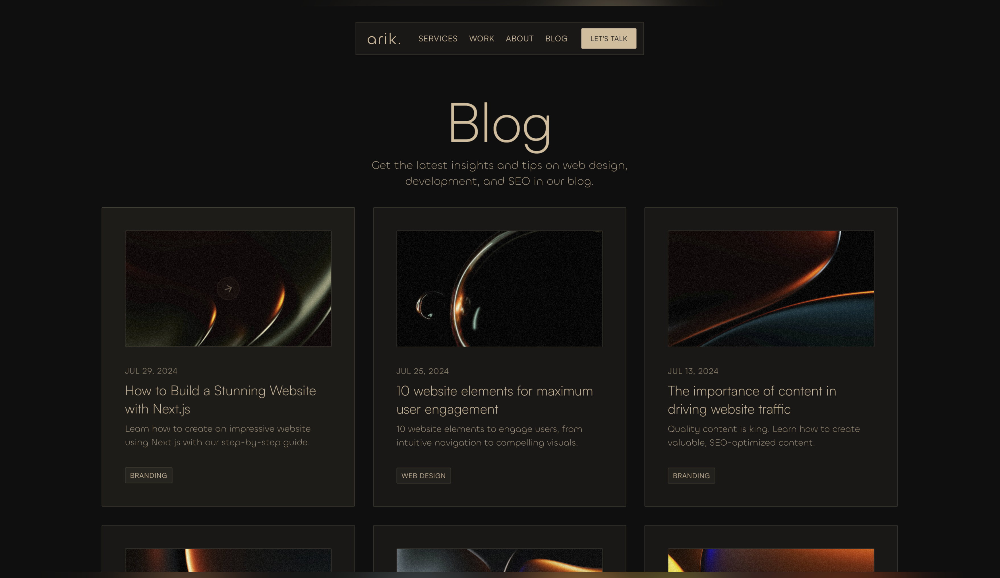
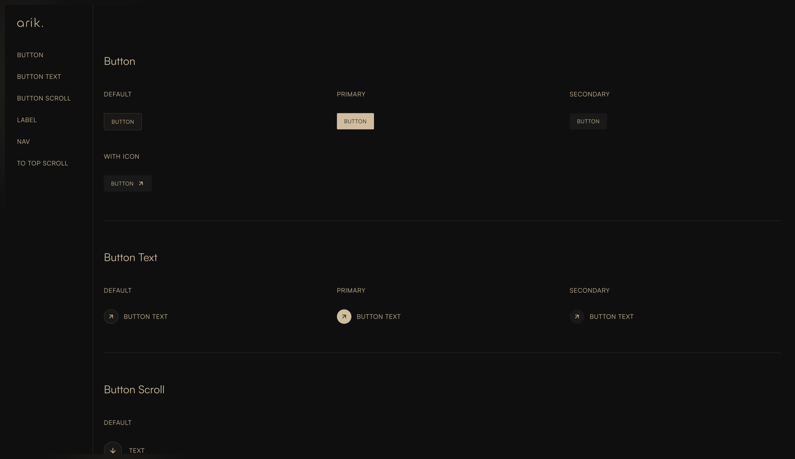

# Arik Portfolio Template

A sophisticated, modern portfolio template featuring fluid animations and a polished design. Built with cutting-edge web technologies including Next.js 15, TypeScript, TailwindCSS, and Motion, this template offers a perfect balance of performance, aesthetics, and developer experience.

## Demo

- [Live Demo](https://arik-portfolio-template.vercel.app)
- [GitHub Repository](https://github.com/tszhong0411/arik-portfolio-template)

## Features

### Technical

- **Next.js 15** - Latest App Router architecture for optimal performance
- **TypeScript** - Enhanced code reliability with static typing
- **TailwindCSS** - Utility-first CSS framework for rapid styling
- **Motion** - Smooth, performant animations and transitions
- **Responsive Design** - Seamless experience across all devices

### UI/UX

- **Dark Mode** - Elegant light/dark theme switching
- **Custom Components** - Reusable, well-structured UI components
- **Smooth Animations** - Carefully crafted motion effects
- **Modern Design** - Clean, professional aesthetic
- **Optimized Images** - Efficient loading with Next.js Image optimization
- **Custom Fonts** - Premium typography with Satoshi and Gambetta fonts

## Screenshots

### Hero



### Work


### Blog



### Components



## Getting Started

### Prerequisites

- Node.js 18 or higher
- Package manager: bun (recommended) / pnpm / npm / yarn

### Installation

```bash
# Clone the repository
git clone https://github.com/tszhong0411/arik-portfolio-template.git

# Navigate to project directory
cd arik-portfolio-template

# Install dependencies
bun install
```

### Development Commands

```bash
# Start development server
bun run dev

# Build for production
bun run build

# Start production server
bun run start
```

## Project Structure

```
arik-portfolio-template/
├── public/              # Static assets
│   ├── fonts/           # Custom fonts
│   └── images/          # Image assets
├── src/
│   ├── app/             # Next.js app router pages
│   │   ├── (main)/      # Main application routes
│   │   └── styleguide/  # Style guide page
│   ├── components/      # Reusable components
│   │   ├── home/        # Home page components
│   │   └── ui/          # UI components
│   ├── utils/           # Helper functions
│   └── config.tsx       # Site configuration
├── .gitignore           # Git ignore rules
├── next.config.ts       # Next.js configuration
├── package.json         # Project dependencies
└── tsconfig.json        # TypeScript configuration
```

## Customization

### Site Configuration

Edit `src/config.tsx` to customize:

- Site metadata (title, description, etc.)
- Personal information
- Projects showcase
- Services offered
- Social media links
- Navigation menu items

### Styling

- Modify `src/app/globals.css` for global styles
- Customize components in `src/components/ui/`

## Contributing

Contributions are welcome! Please follow these steps:

1. Fork the repository
2. Create a new branch: `git checkout -b feature/your-feature`
3. Make your changes
4. Commit your changes: `git commit -m 'Add some feature'`
5. Push to the branch: `git push origin feature/your-feature`
6. Submit a pull request

## License

This project is licensed under the MIT License - see the [LICENSE](./LICENSE) file for details.

## Acknowledgments

### Design

- Web design by [Pawel Gola](https://templates.gola.io/template/arik)

### Assets

#### Images

- [Unsplash Collection](https://unsplash.com/collections/iSPbE51qaJg/arik---framer-template) ([License](https://unsplash.com/plus/license))
- iPhone mockups by [LS.Graphics](https://www.ls.graphics/products/a-mockups-iphone-14-pro) ([License](https://www.ls.graphics/license))
- Macbook mockups by [LS.Graphics](https://www.ls.graphics/products/b-mockups-macbook-16-pro) ([License](https://www.ls.graphics/license))

#### Typography

- [Satoshi](https://www.fontshare.com/fonts/satoshi) ([License](https://www.fontshare.com/licenses/itf-ffl))
- [Gambetta](https://www.fontshare.com/fonts/gambetta) ([License](https://www.fontshare.com/licenses/itf-ffl))
